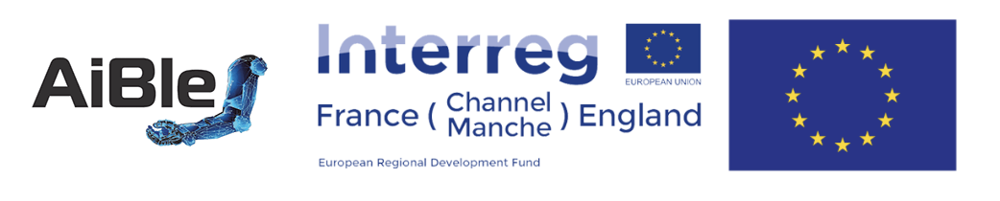

---
hide:
  - navigation
---

## AiBle 
!!! note ""
    - 2020-2023
    - European project Interreg, 5 million euros, 12 partners
    - AiBle: Upper-limb rehabilitation exoskeleton robot based on AI
    - [https://www.euaible.com/](https://www.euaible.com/)

- Project initiator

- Coordinator of UPJV Team, Leader of WP 1 Cloud computing

---

## UV-Bot
!!! note ""
    - 2021-2023
    - European project React-EU
    - UV-Bot based AI
- Project coordinator

---

## Allocation de recherche Hauts-de-France
!!! note ""
    - 2020-2023
    - Regional Project "Allocation de recherche Hauts-de-France"
    - AI-based person following
    - Collaborate with Javier Civera, University of Saragossa, Spain

- Coordinator

---

## Seed4C 
!!! note ""
    - 2012-2015
    - Celtic European project 
    - Seed4C: Secured Embedded Element for Cloud
    - [http://www.celticplus-seed4c.org](http://www.celticplus-seed4c.org/)

- Research engineer.

---

## SAAMR 
!!! note ""
    - 2014-2016
    - Chinese NFSC project (National Natural Science Foundation of China)
    - SAAMR: Software Architectures for Autonomous Mobile Robots Using Model Driven Engineering

- Project participant

---

## TERESA 
!!! note ""
    - 2009-2012
    - FP7 European project 
    - TERESA: Trusted computing Engineering for Resource constrained Embedded Systems Application
    - [TERESA website](https://cordis.europa.eu/project/rcn/93271_en.html)

- Responsable of WP 3