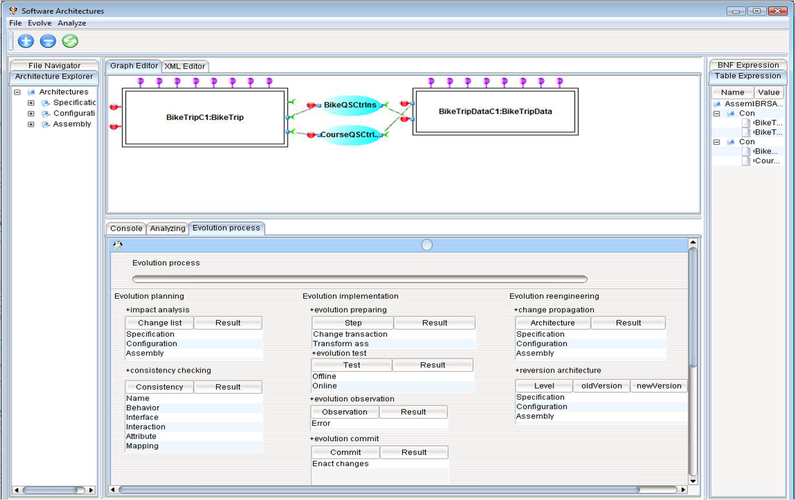

---
hide:
  - navigation
---

## SPS
!!! note ""
    A plugin of OpenStack to support security in Cloud.

<iframe width="560" height="315" src="https://www.youtube.com/embed/xbgtWnxshGQ?si=MrXd12Gv3OXyVZPZ" title="YouTube video player" frameborder="0" allow="accelerometer; autoplay; clipboard-write; encrypted-media; gyroscope; picture-in-picture; web-share" allowfullscreen></iframe>

---

## Crala
!!! note ""
    A tool for modeling Cloud robotic systems.

<iframe width="560" height="315" src="https://www.youtube.com/embed/rmeAzF2dCSQ?si=rVG_OVsjhmNrAr3o" title="YouTube video player" frameborder="0" allow="accelerometer; autoplay; clipboard-write; encrypted-media; gyroscope; picture-in-picture; web-share" allowfullscreen></iframe>

---
## Mango
!!! note ""
    A process metamodel for embedded systems and safety lifecycle

<iframe width="560" height="315" src="https://www.youtube.com/embed/NBxQjF-nY8o?si=s5nv0BQQdg7iFpiq" title="YouTube video player" frameborder="0" allow="accelerometer; autoplay; clipboard-write; encrypted-media; gyroscope; picture-in-picture; web-share" allowfullscreen></iframe>

## SPEM
!!! note ""
    A tool for modeling Cloud robotic systems.

<iframe width="560" height="315" src="https://www.youtube.com/embed/ZKskKGQRDeQ?si=Z4xaLXb2beS4m9o1" title="YouTube video player" frameborder="0" allow="accelerometer; autoplay; clipboard-write; encrypted-media; gyroscope; picture-in-picture; web-share" allowfullscreen></iframe>

---

## DEDAL
!!! note ""
    An architecture description language for component-based software.

